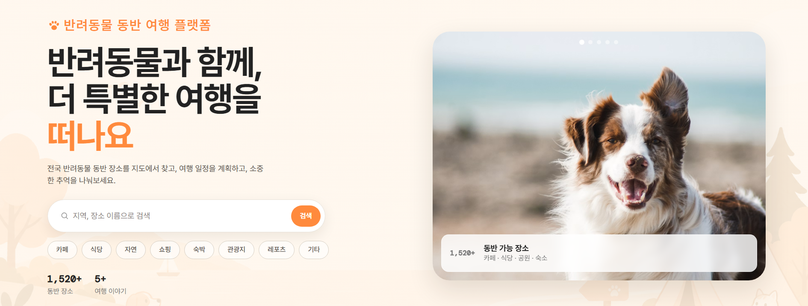
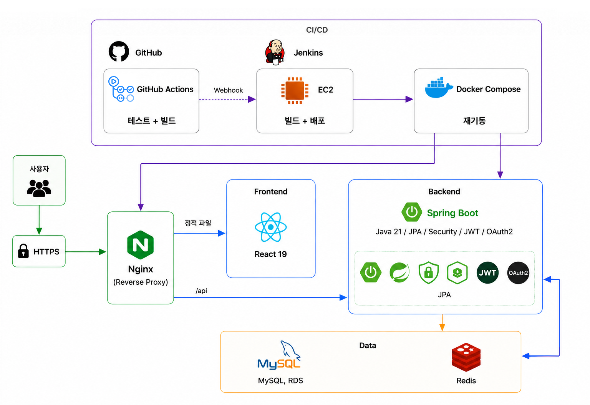
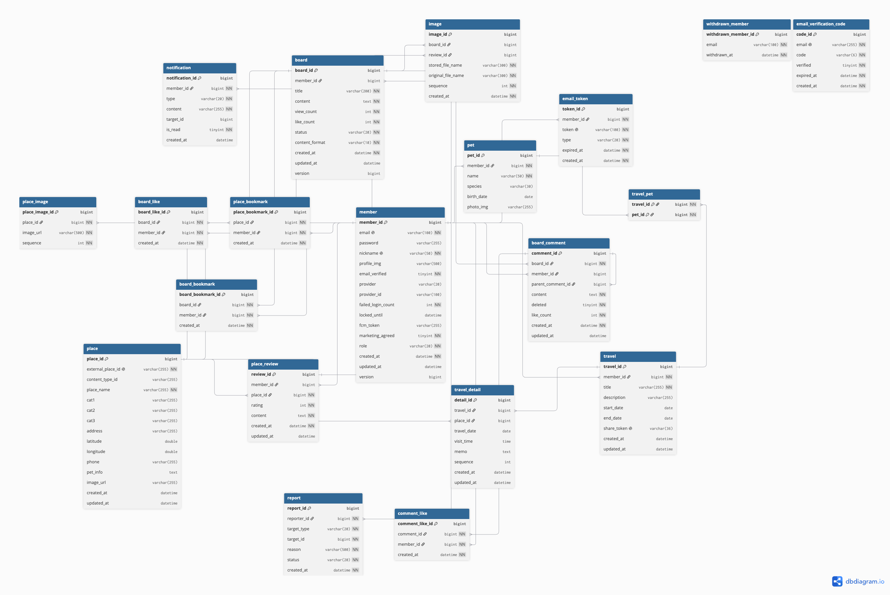

# Tails

### 반려동물 동반 여행 서비스

**반려동물 동반**이 가능한 장소를 검색하고, 일정을 계획해 여행을 떠나보세요.

<br>



<br>

 
[](https://mytails.site) <br>
[](https://github.com/tailsProject/Tails/actions/workflows/ci.yml)


<br>

## 목차

<table>
<tr>
<td align="left">&nbsp;<a href="#팀원-소개">팀원&nbsp;소개</a></td>
<td align="left">&nbsp;<a href="#기획-배경">기획&nbsp;배경</a></td>
<td align="left">&nbsp;<a href="#figma">FIGMA</a></td>
<td align="left">&nbsp;<a href="#주요-기능">주요&nbsp;기능</a></td>
<td align="left">&nbsp;<a href="#styleguide">STYLEGUIDE</a></td>
</tr>
<tr>
<td align="left">&nbsp;<a href="#기술-스택">기술&nbsp;스택</a></td>
<td align="left">&nbsp;<a href="#architecture">ARCHITECTURE</a></td>
<td align="left">&nbsp;<a href="#erd">ERD</a></td>
<td align="left">&nbsp;<a href="#프로젝트-구조">프로젝트&nbsp;구조</a></td>
<td align="left">&nbsp;<a href="#troubleshooting">TROUBLESHOOTING</a></td>
</tr>
</table>

<br>


## 팀원 소개

| [<br>**박한결**](https://github.com/1gyeolpark) | [<br>**박영준**](https://github.com/pyj-0313) |
| :---: | :---: |
| 팀장 | 기획 |

<br> 

**박한결**

| 구분 | 내용 |
| --- | --- |
| Backend | - JWT Access/Refresh 토큰 인증<br>- 카카오·구글·네이버 OAuth2 소셜 로그인, 동일 이메일 계정 자동 연동<br>- 이메일 인증번호 기반 회원가입, 비밀번호 재설정<br>- 게시판 CRUD, 임시저장/발행, 좋아요·북마크, 1단계 대댓글<br>- 게시글·리뷰 이미지 업로드<br>- 반려동물 등록 CRUD<br>- 신고 처리, 관리자 권한 변경, 이벤트 기반 알림 + FCM 웹 푸시 |
| Frontend | - 마이페이지, 여행 일정, 메인페이지 화면 구현<br>- 로그인/회원가입, 관리자, 신고 화면 구현 |

<br>

**박영준**

| 구분 | 내용 |
| --- | --- |
| Backend | - 장소 키워드·카테고리·지역·반경 검색, 평점/찜 랭킹<br>- 찜·리뷰 이력 기반 콘텐츠 기반 개인화 추천(코사인 유사도)<br>- TourAPI(한국관광공사) 연동 장소 데이터 동기화<br>- 장소 찜, 리뷰 CRUD(평균 별점 집계)<br>- 여행 일정 CRUD, 공유 링크 발급, 최근접 이웃 알고리즘 기반 경로 최적화 추천 |
| Frontend | - 공통 인프라(axios, 라우팅), 공통 컴포넌트, 에러 페이지 구현<br>- 지도, 피드(게시판) 화면 구현 |

<br>

## 개정이력

| 날짜 | 내용 |
| --- | --- |
| 2026.07.05 | 프로젝트 시작 |
| 2026.07.14 | 장소 검색 기능 고도화 완료 |
| 2026.07.20 | 백엔드 핵심 기능(이메일 인증, Pet CRUD 등) 완료 |
| 2026.07.22 | 프론트엔드 전체 단계(0~7단계) 구현 완료 |
| 2026.08.04 | README 문서 정리 및 배포 마무리 |

<br>

## 기획 배경

- 반려동물 동반 가능 장소 정보를 한 곳에서 찾기 어려운 문제 
- 반려동물을 위한 **동반 여행 서비스**의 필요성
- 여행 일정 계획부터 공유까지 가능한 통합 여행 서비스 구현

<br>

## FIGMA

- [목업 바로가기](https://www.figma.com/design/ojW787BKVTe6LlI2iXsocA/Tails?node-id=0-1&t=GDQYvztIBb4yeVk0-1)
- [재생 바로가기](https://www.figma.com/proto/ojW787BKVTe6LlI2iXsocA/Tails?node-id=0-1&p=f&t=hyxkfy7mNKXl5jVO-0&scaling=min-zoom&content-scaling=fixed&page-id=0%3A1&starting-point-node-id=2%3A378&fuid=1608331975332768453)

<details open>
<summary><h2>주요 기능</h2></summary>


### 메인

- 지도 바로 검색, 카테고리 바로가기 제공
- 인기 장소, 인기 게시글, 최근 리뷰 확인
- 로그인한 사용자에게 이용 이력 바탕 개인화 추천 장소 제공

https://github.com/user-attachments/assets/096f6f20-eb68-4448-a692-e46e845fa8e7

<br>

### 로그인 및 회원가입

- 이메일과 비밀번호를 통한 가입
- 카카오, 구글, 네이버 소셜 로그인 제공
- 비밀번호 재설정 가능
-  로그인 인증은 JWT 액세스 토큰과 리프레시 토큰을 사용해 처리

https://github.com/user-attachments/assets/c9a69a47-6712-494b-a440-1211e4c67d01

<br>

### 지도

- 장소를 키워드, 카테고리, 지역, 반경 조건으로 검색
- 장소 상세 정보, 사진, 리뷰, 별점 확인 가능
- 관심 장소 찜 기능

https://github.com/user-attachments/assets/2f985333-07e0-4e9b-ae27-1567c94f384e

<br>

### 피드

- 게시글 작성, 조회
- 게시글 임시저장 기능
- 댓글, 대댓글 작성
- 게시글과 댓글 좋아요 기능
- 게시글 마크다운, 북마크, 이미지 첨부 기능

https://github.com/user-attachments/assets/59d4e300-ab1e-4518-a0bd-1aa7d6e3216d

<br>

### 여행 일정

- 여행 일정 생성, 관리
- 방문 장소 추가, 순서 변경
- 알고리즘 기반 경로 최적화 추천 기능 제공
- 공유 링크 발급해 외부 공개 가능

https://github.com/user-attachments/assets/e474571a-8ebc-4017-a28a-cf2bbbe97aa7

<br>

### 마이페이지

- 내 정보, 반려동물 추가, 내 글, 내 리뷰, 북마크 글, 신고 내역, 알림 확인 가능
- 내 정보: 닉네임 변경, 프로필 사진 변경, 비밀번호 변경, 마케팅 정보 수신 여부 재설정, 로그아웃, 회원 탈퇴 가능
- 알림은 알림함과 FCM 웹 푸시 두 가지 방식 모두 제공

https://github.com/user-attachments/assets/530139a4-6ef5-48b1-bf7c-ec5052c7f00d

<br>

### 관리자

- 마이페이지에서 관리자 페이지 진입 가능
- 회원 권한 변경, 추방 가능
- 신고된 게시글, 댓글, 회원을 처리 가능

https://github.com/user-attachments/assets/06897ec9-b492-4060-987e-8c4d3c6a9822

<br>

### 반응형


</details>

<br>

<details>
<summary><h2>STYLEGUIDE</h2></summary>

### 컬러

**Brand**

| 컬러 | 이름 | 값 | 용도 |
|:---:|---|---|---|
|  | Primary | `#ff8a3d` | CTA / 활성 상태 / 강조 |
|  | Primary Strong | `#e5722a` | hover · pressed |
|  | Primary Soft | `#fff1e6` | 틴트 배경 / 뱃지 |
|  | Secondary | `#2f9e8f` | 지도 경로 / 이동 정보 |

**Warm Neutral**

| 컬러 | 이름 | 값 | 용도 |
|:---:|---|---|---|
|  | Ink | `#16130f` | 본문 · 다크 서피스 |
|  | Ink 2 | `#55504a` | 보조 텍스트 |
|  | Ink 3 | `#8b857d` | 캡션 · placeholder |
|  | Line | `#e8e2d9` | 테두리 · 구분선 |
|  | Canvas | `#f7f4ef` | 페이지 배경 |
|  | Surface | `#ffffff` | 카드 · 패널 |

**Semantic**

| 컬러 | 이름 | 값 | 용도 |
|:---:|---|---|---|
|  | Error | `#e0432b` | 유효성 실패 · 삭제 |
|  | Success | `#2e9e5b` | 인증 완료 · 저장 |
|  | Warning | `#d98a00` | 미인증 · 주의 |

<br>

### 타이포그래피

- 한글 본문: **Pretendard Variable**
- 숫자 강조(통계 수치 등): **DM Mono**

</details>

<br>

<details>
<summary><h2>설치 및 실행</h2></summary>

### 사전 준비

- Java 21
- Node 18 이상
- Docker & Docker Compose (MySQL, Redis 컨테이너 실행용)

### Backend

```
cd backend
cp src/main/resources/application.properties.example src/main/resources/application.properties
```

- `application.properties`에서 `JWT_SECRET` 등 값 채우기, 소셜 로그인은 더미 값으로 대체 가능
- Firebase(FCM), TourAPI, 메일 발송은 값 비워두면 자동 비활성화

```
docker compose up -d      # MySQL, Redis, app 컨테이너 실행
```

또는 MySQL·Redis만 띄우고 서버는 로컬에서 직접 실행:

```
docker compose up -d mysql redis
./gradlew bootRun
```

서버는 `http://localhost:8080`에서 확인 가능합니다.

### Frontend

```
cd frontend
cp .env.example .env
```

- `VITE_KAKAO_MAP_KEY` 등 값 채우기, FCM 관련 값은 비워두면 알림 버튼만 비활성화

```
npm install
npm run dev
```

`http://localhost:3000`에서 확인 가능합니다.

</details>

<br>

## 기술 스택

**Backend**


**Frontend**


**Infra 및 CI/CD**


**외부 API**


<br>

## ARCHITECTURE

[](architecture.png)

- React SPA와 Spring Boot API 분리, MySQL과 Redis를 각각 데이터/세션 저장소로 사용하는 구조
- Docker Compose로 EC2에 배포
- GitHub Actions로 빌드·테스트 자동화

<br>

## ERD

[](erd.png)

Tails의 테이블 구조와 관계를 나타낸 ERD
- 전체 20개 테이블과 컬럼, 관계를 포함한 다이어그램
- 리프레시 토큰은 테이블이 아닌 Redis에 저장돼 다이어그램에는 없음
- WITHDRAWN_MEMBER, EMAIL_VERIFICATION_CODE는 각각 탈퇴 후·회원가입 전 시점이라 MEMBER와 FK 없이 독립적으로 존재

<br>

## 프로젝트 구조

### BACKEND

```
backend/src/main/java/com/tails
├── admin         # 관리자 권한 변경, 신고 처리
├── board         # 게시글 CRUD, 임시저장, 좋아요
├── bookmark      # 게시글/장소 북마크
├── comment       # 댓글, 대댓글
├── common        # 예외 처리, 메일, 응답 형식, 보안, 유틸리티
├── config        # 스프링 설정 빈
├── image         # 이미지 업로드
├── member        # 회원가입, 로그인, 내 정보
├── notification  # 알림, FCM 푸시
├── pet           # 반려동물 등록
├── place         # 장소 조회, 검색, 추천
├── report        # 신고
├── review        # 장소 리뷰
├── travel        # 여행 일정
└── traveldetail  # 여행 상세 일정
```

- 도메인 패키지 하나당 Controller, Service, Repository, Entity, dto를 모두 포함
- common은 여러 도메인이 함께 쓰는 예외 처리, 메일, 응답 형식, 보안, 유틸리티만 모음

<br>

### FRONTEND

```
frontend/src
├── api           # axios 공통 인스턴스, 토큰 저장/재발급
├── features      # 화면 단위 도메인 폴더
│   ├── admin     # 관리자 페이지
│   ├── auth      # 로그인, 회원가입
│   ├── board     # 게시글, 댓글
│   ├── error     # 404, 에러 페이지
│   ├── main      # 메인 페이지
│   ├── mypage    # 마이페이지
│   ├── place     # 지도, 장소 상세
│   ├── report    # 신고
│   └── travel    # 여행 일정
├── components    # 여러 화면에서 재사용하는 공통 컴포넌트
│   ├── Button
│   ├── Icon
│   ├── Layout        # 헤더, 푸터
│   ├── Modal
│   ├── Pagination
│   ├── StateMessage  # 빈 상태, 에러 상태 표시
│   └── Toast
├── context       # 전역 상태 (인증 등)
├── hooks         # 커스텀 훅
├── routes        # 라우터 설정
├── styles        # 전역 스타일, 변수
└── utils         # 공통 유틸 함수
```

- features 안 폴더 하나가 화면 하나를 담당하며, 해당 화면에서 쓰는 API 호출 함수도 함께 포함
- 여러 화면에서 반복해서 쓰는 컴포넌트만 components로 분리

<br>

## TROUBLESHOOTING

<details>
<summary><b>PasswordEncoder 순환 참조로 서버가 기동되지 않던 문제</b></summary><br>

- **문제**: 코드는 컴파일이 잘 되는데, 막상 서버를 실행하면 켜지지 않음
- **원인**: `AuthService` → `PasswordEncoder`(`SecurityConfig` 안에 정의) → `OAuth2SuccessHandler` → 다시 `AuthService`로 돌아오는 순환 참조 구조였음
- **해결**: `PasswordEncoder`를 의존성 없는 `PasswordEncoderConfig`로 옮김. 이 클래스는 바로 만들어지니, `AuthService`와 `SecurityConfig`는 서로를 기다릴 필요 없이 이미 준비된 `PasswordEncoder`를 갖다 쓰기만 하면 됨<br><br>

**해결 전** 
- `config/SecurityConfig.java`
```java
@Bean
public PasswordEncoder passwordEncoder() {
    return new BCryptPasswordEncoder();
}
```

**해결 후**
- `config/PasswordEncoderConfig.java`로 분리
```java
// PasswordEncoder를 SecurityConfig에서 분리 - AuthService 순환참조 회피
@Configuration
public class PasswordEncoderConfig {

    @Bean
    public PasswordEncoder passwordEncoder() {
        return new BCryptPasswordEncoder();
    }
}
```
<br>
</details>

<details>
<summary><b>좋아요를 동시에 눌렀을 때 500 에러가 뜨던 문제</b></summary><br>

- **문제**: 같은 게시글에 좋아요 요청이 거의 동시에 들어오면 500 에러 발생
- **원인**: 동시 수정을 막기 위한 버전 검증(낙관적 락)에 걸린 경우인데, 이에 대한 처리가 없어서 다른 예외들과 함께 서버 오류로 처리됨. 사실 재요청하면 대부분 바로 해결되는 일시적 충돌
- **해결**: 이 예외만 따로 잡아서 500 대신 409(재시도 가능)로 응답하도록 처리 추가<br><br>

**해결 전**
- `GlobalExceptionHandler.java`
- 전용 핸들러가 없어 catch-all로 떨어짐
```java
@ExceptionHandler(Exception.class)
public ResponseEntity<ApiResponse<Void>> handleUnexpectedException(Exception e) {
    log.error("예상하지 못한 서버 오류", e);
    return ResponseEntity.status(ErrorCode.INTERNAL_SERVER_ERROR.getStatus())
            .body(ApiResponse.error(ErrorCode.INTERNAL_SERVER_ERROR));
}
```

**해결 후**
- 전용 핸들러 추가
```java
@ExceptionHandler(ObjectOptimisticLockingFailureException.class)
public ResponseEntity<ApiResponse<Void>> handleOptimisticLockingFailure(ObjectOptimisticLockingFailureException e) {
    log.warn("낙관적 락 충돌 (동시 요청으로 인한 경쟁 상황)", e);
    return ResponseEntity.status(ErrorCode.CONCURRENT_UPDATE_CONFLICT.getStatus())
            .body(ApiResponse.error(ErrorCode.CONCURRENT_UPDATE_CONFLICT));
}
```
<br>
</details>

<details>
<summary><b>게시글 상세 조회 시 조회수가 두 번씩 오르던 문제</b></summary><br>

- **문제**: 개발 중 게시글 상세 페이지를 열면 조회수가 한 번에 2씩 올라감
- **원인**: React가 개발 모드에서 화면을 일부러 두 번 그려보는 StrictMode 때문에 조회 API가 같은 글에 대해 중복 호출됨. 게다가 새로고침 직후엔 로그인 세션 복구가 끝나기 전에 요청이 나가서, 로그인한 작성자 본인인데도 비로그인으로 처리돼 조회수가 잘못 오르는 경우도 있었음
- **해결**: 같은 글 ID로는 한 번만 요청하도록 막고, 로그인 세션 복구가 끝날 때까지 요청을 미룸<br><br>

**해결 전**
- `features/board/BoardDetailPage.jsx`
```jsx
const { member, isAuthenticated } = useAuth();

useEffect(() => {
  getBoardDetail(boardId).then((res) => setBoard(res.data.data));
  getImages(boardId).then((res) => setImages(res.data.data));
}, [boardId]);
```

**해결 후**
```jsx
const { member, isAuthenticated, isLoading: isAuthLoading } = useAuth();
const requestedBoardIdRef = useRef(null);

useEffect(() => {
  if (isAuthLoading) return;                             // 세션 복구 끝날 때까지 대기
  if (requestedBoardIdRef.current === boardId) return;    // 같은 글은 중복 요청 안 함
  requestedBoardIdRef.current = boardId;

  getBoardDetail(boardId).then((res) => setBoard(res.data.data));
  getImages(boardId).then((res) => setImages(res.data.data));
}, [boardId, isAuthLoading]);
```
<br>
</details>

<details>
<summary><b>존재하지 않는 경로를 요청했을 때 500 에러가 뜨던 문제</b></summary><br>

- **문제**: 오타 난 URL이나 없는 경로로 요청하면 404가 아니라 500 에러 발생
- **원인**: 예외를 한곳에서 모아 처리하는 `GlobalExceptionHandler`에 "요청한 자원이 없음"(`NoResourceFoundException`)에 대한 처리가 빠져 있어서, catch-all 핸들러에 걸려 "알 수 없는 서버 오류"로 뭉뚱그려 처리됨
- **해결**: 해당 예외를 따로 잡아서 404로 응답하도록 처리 추가<br><br>

**해결 전**
- `GlobalExceptionHandler.java`
- 전용 핸들러가 없어 아래 catch-all로 떨어짐
```java
@ExceptionHandler(Exception.class)
public ResponseEntity<ApiResponse<Void>> handleUnexpectedException(Exception e) {
    log.error("예상하지 못한 서버 오류", e);
    return ResponseEntity.status(ErrorCode.INTERNAL_SERVER_ERROR.getStatus())
            .body(ApiResponse.error(ErrorCode.INTERNAL_SERVER_ERROR));
}
```

**해결 후**
- 전용 핸들러 추가
```java
@ExceptionHandler(NoResourceFoundException.class)
public ResponseEntity<ApiResponse<Void>> handleNoResourceFound(NoResourceFoundException e) {
    return ResponseEntity.status(ErrorCode.RESOURCE_NOT_FOUND.getStatus())
            .body(ApiResponse.error(ErrorCode.RESOURCE_NOT_FOUND));
}
```
<br>
</details>
